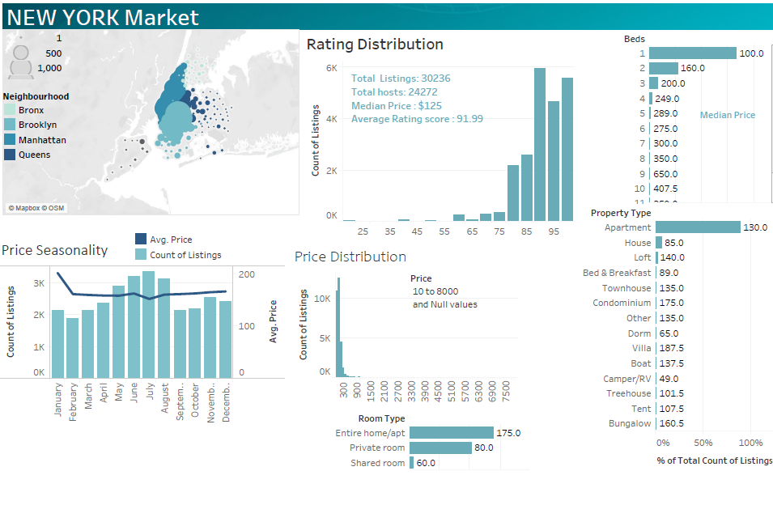

# Final-Project-Tableau
For this project , I choose Option 2 with the Dataset for Airbnb New York.
## Project/Goals
My objectives in this project are
- to understand the data following the EDA process
- identify the scope of the problem: questions to answer from the data
- learn and make differents visualization with tableau
- analyze data and identify relevant points
- develop the story content to present 
- make some dashboards and story accordingly
- Identify required analysis and data to support the decision making process
## Process
### EDA
 Using Python, I removed the duplicates rows and the null values for all the columns except for the Review Scores Rating. Removing the later will remove 8320 which represents about 25% of the records. I prefer to keep them in my data and exclude the those records with Tableau features when I want to compute anthing with Review Scores Rating
### EDA with Tableau
- While reviewing the data format, I noticed that beds are set as measure differently than property type or room type, therefore I duplicated the columns and created it as a dimension.
- Changed the country setting in the map to US to recognize the zipcodes
- creates two a calculation field to compute the top 3 hosts for listing and reviews
- removed the measure Review Scores Rating (bin) from the data and created a dimension that with parameter that could vary.
### Analysing the data
I followed a funnel approach. I started the analysis at city level, then neighbourhood and finaling at room type level that I considered as the best variable to identify the customers requirement.
### Identifying the project scope
The scope of the analysis includes:
- Uderstanding the Airbnb market in NY: what type of properties are available? where are they located? what is the price range? what are the rating scores? what kind of propreties are available for rent? is there any seasonality effect?
- Understading the market at the neighbourhood level: Type of room/ properties/ bed size vailable for rent and at what price and rating score?
- If I want to put a property for rent or invest? what price and rating should I aim for and where?
- If I am a short term visitor, what can afford in NY? what should I expect from service perspective?
- Does the rating affect the price level?
- What are the trends and forecast for the listing price?

### analyze the finding
### develop the content of the story and prepare the presentation using Tableau
### identify missing data to analyze to support the decision making process
Going through the data and analysis, I realized that I missing some meanful information to reach any decision such as:
- Bookings by listing: to calculate the rate of occupancy for properties and
revenues
- Expenses related to any type of property (maintenance, cleaning, hydro etc)
- City regulations for short term rentals and related taxes
- Breakdown at sub-neighbourhood/zip codes(available: need more analysis)
- Real state data if our investor planning to rent/buy a new place
- Mortgage rate and client budget
- Neighbourhood safety indicators
- Public transportation access

## Results
### Data set selected:
For this project , I choose Option 2 with the Dataset for Airbnb New York.
### Questions to answer:
The questions that I tried to answer are :
- Uderstanding the Airbnb market in NY: what type of properties are available? where are they located? what is the price range? what are the rating scores? what kind of propreties are available for rent? is there any seasonality effect?
- Understading the market at the neighbourhood level: Type of room/ properties/ bed size vailable for rent and at what price and rating score?
- If I want to put a property for rent or invest? what price and rating should I aim for and where?
- If I am a short term visitor, what can afford in NY? what should I expect from service perspective?
- Does the rating affect the price level?
- What are the trends and forecast for the listing price?
### Analysis:
#### NY market:

We have the followings:
- 30236 listings and 24272 hosts mainly located in Manhattan and Brooklyn
- more listings in the summer with almost the sam price across the year exception a drop in july and raise in january but it doesn't follow the offer during the year.
- Price distribution is skewed to the right with a range from $10 to $8000 (I assume by night). Many outliers, therefore we will be using the median price for further analysis
- Rating score reviews distibution skewed to the left with a mode between 90-95. Average 91.99. Median 94. for this one we considered the average since there are not many outliers.
- Most of the listings are for appartment type 89%, one or one bed 67% or two beds 22%, 56% entire home and 42% Private rooms

#### Neighbourhood Comparison
##### comparison table
From count of listings we can see that it is mainly in Manhattan with 53% and Brooklyn with 38%. Also Manhatan has the highest median followed by Brooklyn. From rating score, all the neighbourhood have an average score of 92% and staten island 91%.
#### Heat map
From reviews Manhattan have 55% from the total and Brooklyn 37%.
It is intersting to notice from the heat map that the short term rental are again entire home and private room maily located in mahattan 

## Challenges 
(discuss challenges you faced in the project)

## Future Goals
(what would you do if you had more time?)
