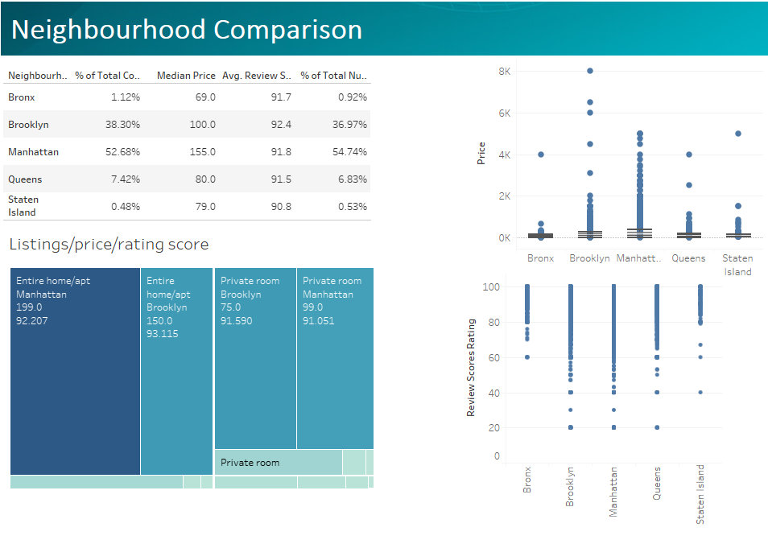
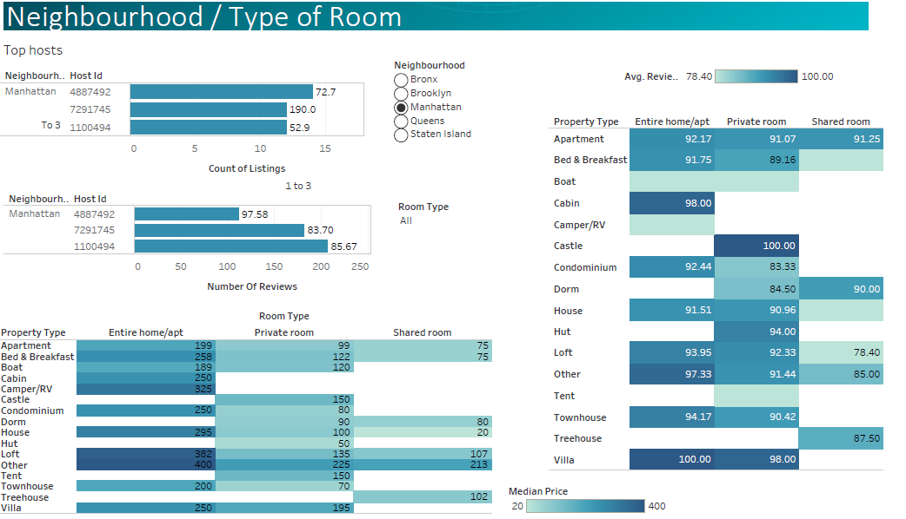
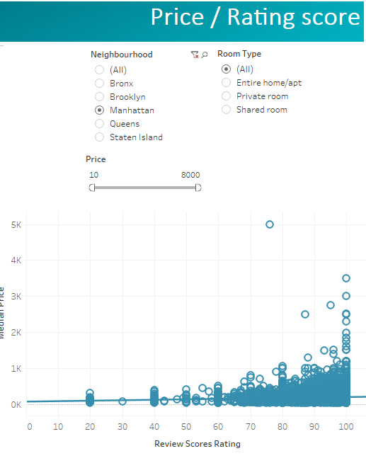
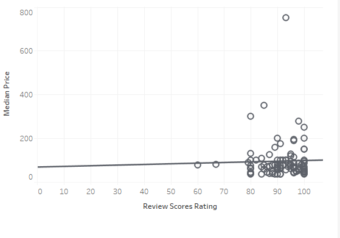
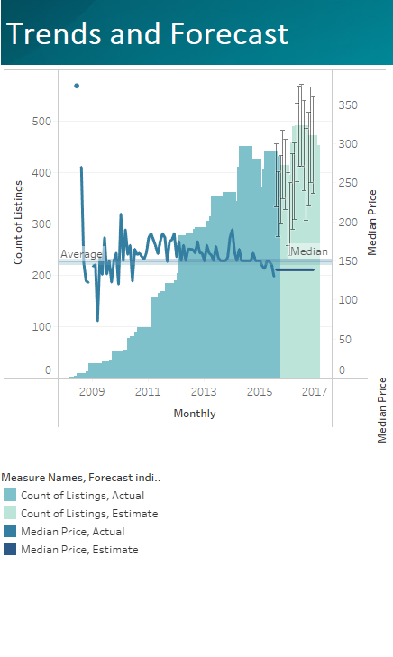

# Final-Project-Tableau
For this project, I choose Option 2 with the Dataset for Airbnb New York refer to Airbnb excel file.
## Project/Goals
My objectives in this project are to:
- understand the data following the EDA process
- identify the scope of the problem: questions to answer from the data
- learn and make different visualizations with tableau
- analyze data and identify relevant points
- develop the story content to present 
- make some dashboards and story accordingly
- Identify required analysis and data to support the decision-making process
## Process
### EDA
 Using Python, I removed the duplicates rows and the null values for all the rows except for the Review Scores Rating. Removing the later will remove 8320 which represents about 25% of the records. I preferred to keep them in my data and exclude those records with Tableau features when I want to compute anything with Review Scores Rating.
I also removed the column “number of records”
### EDA with Tableau
- While reviewing the data format, I noticed that beds are set as measure differently than property type or room type, therefore I duplicated the columns and created it as a dimension.
- Changed the country setting in the map to US to recognize the zip codes
- creates some calculation fields ex: compute the top 3 hosts for listing and reviews
- removed the measure Review Scores Rating (bin) from the data and created a dimension with parameter that could vary

### Analysing the data
I followed a funnel approach. I started the analysis at city level, then neighbourhood and finally at room type level that I considered as the best variable to identify the customers requirement

### Identifying the project scope
The scope of the analysis includes:
- Understanding the Airbnb market in NY: what type of properties are available? where are they located? what is the price range? what are the rating scores? what kind of properties are available for rent? is there any seasonality effect?
- Understanding the market at the neighbourhood level: Type of room/ properties/ bed size available for rent and at what price and rating score?
- If I want to put a property for rent or invest? what price and rating should I aim for and where?
- If I am a short-term visitor, what can I afford in NY? what should I expect from service perspective?
- Does the rating affect the price level?
- What are the trends and forecast for the listing price?

### analyze the finding

### develop the content of the story and prepare the presentation using Tableau

### identify missing data to analyze to support the decision-making process
Going through the data and analysis, I realized that I am missing some critical information to reach any decision such as:
- Bookings by listing: to calculate the rate of occupancy for properties and
revenues
- Expenses related to any type of property (maintenance, cleaning, hydro etc.)
- City regulations for short term rentals and related taxes
- Breakdown at sub-neighbourhood/zip codes (available: need more analysis)
- Real state data if our investor planning to rent/buy a new place
- Mortgage rate and client budget
- Neighbourhood safety indicators
- Public transportation access

## Results
### Data set selected:
For this project, I choose Option 2 with the Dataset for Airbnb New York.
### Questions to answer:
The questions that I tried to answer are:
- Understanding the Airbnb market in NY: what type of properties are available? where are they located? what is the price range? what are the rating scores? what kind of properties are available for rent? is there any seasonality effect?
- Understanding the market at the neighbourhood level: Type of room/ properties/ bed size available for rent and at what price and rating score?
- If I want to put a property for rent or invest? what price and rating should I aim for and where?
- If I am a short-term visitor, what can afford in NY? what should I expect from service perspective?
- Does the rating affect the price level?
- What are the trends and forecast for the listing price?

### Analysis:
#### NY market:

We have the followings:
- 30236 listings and 24272 hosts mainly located in Manhattan and Brooklyn
- more listings in the summer with almost the same price across the year exception a drop in July and raise in January but it doesn't follow the offer during the year.
- Price distribution is skewed to the right with a range from $10 to $8000 (I assume by night). Many outliers, therefore, we will be using the median price for further analysis.
- Rating score reviews distribution skewed to the left with a mode between 90-95. Average 91.99. Median 94. for this one we considered the average since there are not many outliers.
- Most of the listings are for apartment type 89%, one or one bed 67% or two beds 22%, 56% entire home and 42% Private rooms

#### Neighbourhood Comparison

##### Comparison table
From the count of listings, we can see that it is mainly in Manhattan with 53% and Brooklyn with 38%. Also, Manhattan has the highest median followed by Brooklyn. From rating score, all the neighbourhood have an average score of 92% and Staten island 91%
From reviews Manhattan have 55% from the total and Brooklyn 37%.
#### Heat map
The heat map shows clearly that the listings are mainly entire home and private room located in Manhattan and Brooklyn and Private room in Queens.
#### Boxplot price
The price comparison using the box plot shows that while the distributions are in the low end for the price, it is comparable at a glance from a neighbourhood to another (hypothesis needs to be confirmed with statistical- test not conducted)
All neighbourhoods have many outliers.
More variance in Manhattan and Brooklyn probably related to the volume of listings.

#### Boxplot rating score
For the rating distribution, it is spread, and we don't see any mode.
We see also that low scores are mainly in the 3 neighbourhood mentioned above (probably related to low listings in the others)

Summary:
Available short-term Airbnb in NY are mainly entire home or private room type.
The choice is more in Manhattan and Brooklyn for both type, private room in Queens.
The median price is higher in Manhattan than Brooklyn and less in Queens.
The average score is better for both in Brooklyn than Manhattan. It could be related to customers expectations.

#### Neighbourhood/Room Type

This analysis help to you to see what the prices/ratings/ type of propriety are based on your choice of location or/and room type.
It helps also to give information on the top 3 hosts from listing and from rating score.

We will assume that demand in the market is reflected by total listing for analysis purpose.

The following analysis help to decide the following:
For a current owner:
Knowing the location of the propriety and type, they can see what the market price is and decide what type of room rental they should target.
They can also see what kind of rating score they must meet.
Finally, they can see who the top hosts are and consults their listing to see what they offer.

For future owner:
Similarly, based on their real state budget they can decide which neighbourhood to target and what price to meet for rent by type of propriety.

For someone visiting in short term:
Based on their budget they can see what they can afford as type of propriety/room and location and what to expect from rating score. They can also see who the hosts with the highest listing reviews are.

Note: similar analysis could give further information if we put a table with propriety and bed counts

#### Price/Rating score

For this analysis, I used the scatter plot. It could be changed based on neighbourhood and/or room type.

This analysis we have a linear trendline between the median price and the rating score for every neighbourhood.
All show that the coefficient for rating score is significant however R-squared value is very low [0.5%-1.6%] except for Staten island 30% with a negative coefficient which goes against expectation this is due to an outlier.

if we lower the price range using the price filter to 1200$ we can see that for the later the coefficient is positive and R-squared is 0.6% still not a good indicator for the price change.

Summary: the rating score doesn't help to predict the price significantly. One point to notice are most of location with high price get 100% rating score.

#### Trends and Forecast

This analysis can be done by selecting neighbourhood or/and room type
For this analysis I lowered the range of price to $1250 to eliminate outliers.

The trends are as following if we ignore the room type:
-	For Manhattan and Brooklyn
The price is going down and the volume is increasing slightly.
The forecast predicts a stable price set to a value less than the actual Median and a slight increase in the volume however for both variables the range of variability is very wide.
-	For the others:
The price is fluctuating around the median and the volume is in mid-range for Staten Island and Bronx and slightly high for Queens.
The forecast predicts a stable price set to a value equal to the actual Median and a decrease in the volume however for both variables the range of variability is very wide.

## Challenges 
The main challenge was to know how to use Tableau properly. I still need to find out how to add a vertical median/ average line to my histogram.

The other challenge was related to the data itself: for the purpose of this analyse the occupancy rate could have brought more insight to the analysis specially that the number of listings could not be a representative of the demand.

## Future Goals
If I had more time, I would add the analysis based in bed/ property type.
Furthermore, I will conduct more analysis with complementary data such as:

- Bookings by listing: to calculate the rate of occupancy for properties and
revenues
- Expenses related to any type of property (maintenance, cleaning, hydro etc.)
- City regulations for short term rentals and related taxes
- Breakdown at sub-neighbourhood/zip codes(available: need more analysis)
- Real state data if our investor planning to rent/buy a new place
- Mortgage rate and client budget
- Neighbourhood safety indicators
- Public transportation access
